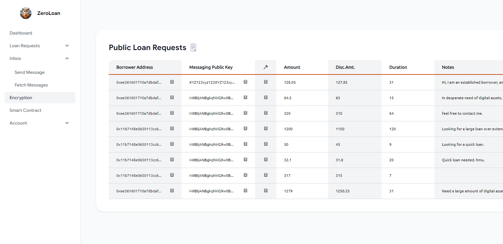

## Decentralized Lending Platform with Zero-Knowledge Proof-Based Credit

This project is a full-stack implementation of a proposed protocol enabling decentralized lending based on zero-knowledge proof-based credit fostering more efficient virtual asset liquidity.

- in partial fulfillment of the requirements for COMP 4981 in the Department of Computer Science and Engineering, The Hong Kong University of Science and Technology;

- and in partial fulfillment of the requirements for CPEG 4901 in the Computer Engineering Program Office, The Hong Kong University of Science and Technology.


<i>Figure 1: Screen Capture of the Loan Requests List Page of the Demo Web Application</i>


### Design Overview
---
#### 1. Architecture Overview
The project principally follows a MERN-stack structure:
##### Frontend:
- Vite (frontend build tool for HMR support and faster builds)
- React Typescript
##### Backend:
- Express Typescript
- Node.js
- The backend express app uses nodemon for HMR support.
##### Database:
- MongoDB (currently hosted via Mongo Atlas for dev)
- The backend uses the mongoose Object Data Modeling (ODM) library
##### Python Local Script
- Python Executable


#### 2. Codebase Structure
The frontend react app is separate from the backend express app, each having their own node package management.

##### Frontend:
`./utils` currently contains utility functions for formatting
`./public` should contain all the static files, like stylesheets, images etc. (e.g.`./public/images`)
The codebase uses a .env.local file for abstracting sensitive information from the source code that is published to Github.
##### Backend:
The codebase uses .dotenv (`/.env`) files for abstracting sensitive information from the source code that is published to GitHub.
##### Python Local Script
The Python Local Script is compiled and packaged as an executable for accessibility and convenience.
##### Smart Contracts
This directory contains the source code of our deployed Smart Contract on-chain.

### Setup
---
1. `cd` into and run `npm install` in both the `./backend` and `./frontend` directories
2. Backend: create an `.env` file under `./backend` first before running `npm run dev` to start the backend server
```
MONGO_URI = <YourBackendEndpointAPI>
PORT = <SpecifiedBackendPort>
```
3. Frontend: create an `.env.local` file under `./frontend` first before running `npm run dev` to start the frontend server
```
VITE_SEPOLIA_CONTRACT_ADDRESS = '0xe789df42675449166f8fcf0a0239b05973c6b9a7' (This is public address of our deployed Smart Contract)
VITE_LOCAL_SCRIPT_HOST = <SpecifiedLocalScriptHost: Expected 5000>
VITE_BACKEND_HOST = <SpecifiedBackendHost: Must be same as in ./backend/.env>
```
